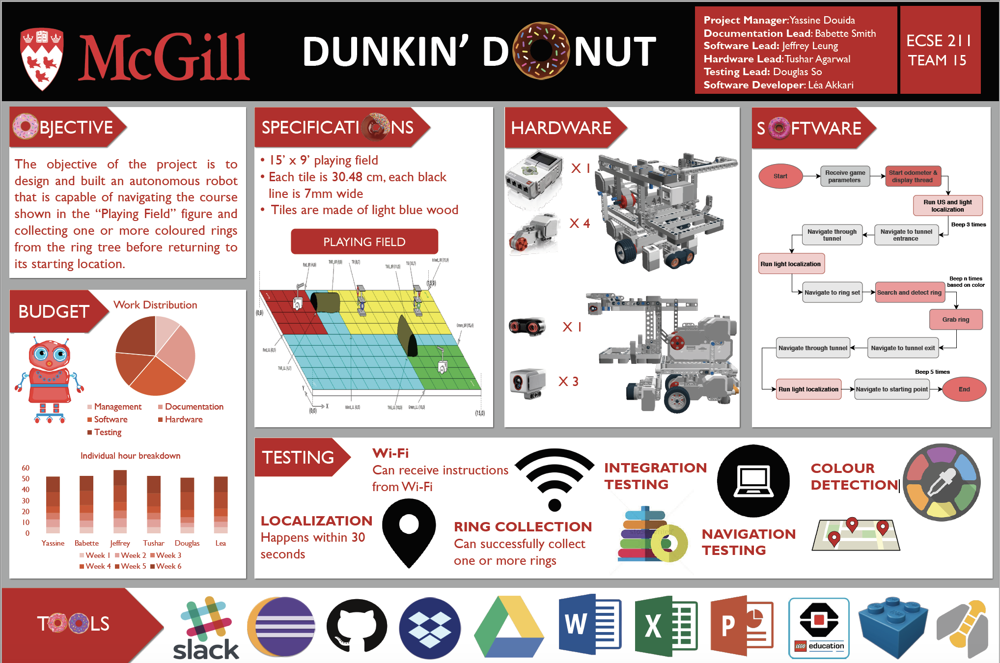
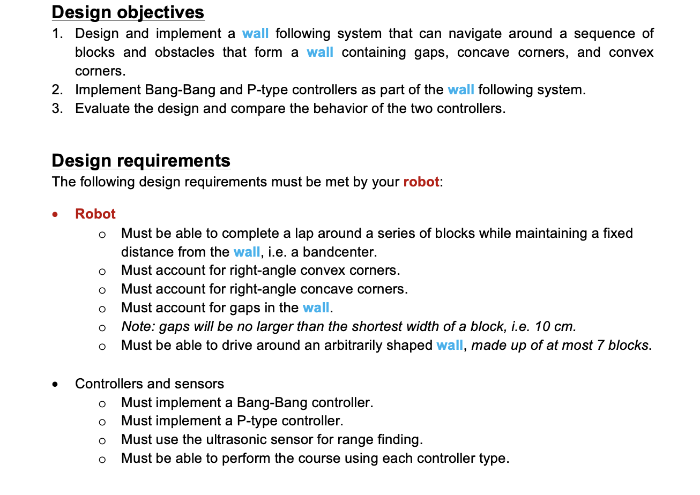
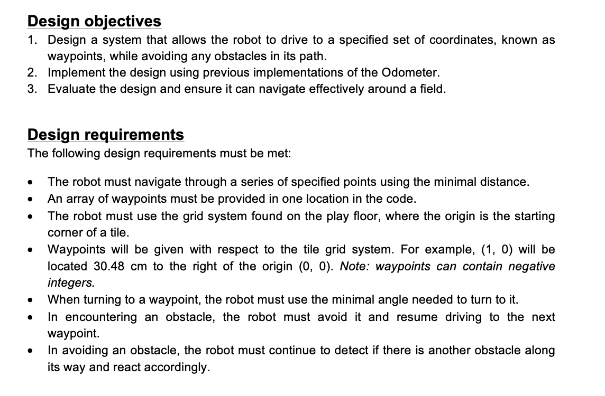
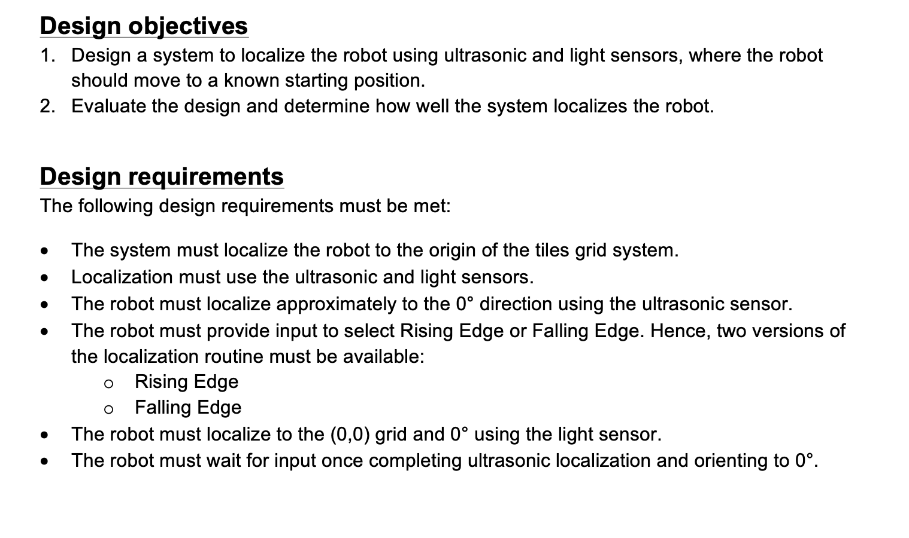

# Design Principle and Methods

## About the Design Project: 

### The goal of this project is to design and construct a machine that can autonomously navigate a closed course in search of a set of colored rings. Once found, the machine must determine how to grasp and retrieve as many rings as possible, taking into account the value of each ring asdepicted by its color. In order to count, a ring must be returned to the starting corner. 

---
Consider the scenario depicted in the figure above, with two players labeled 1 and 3. The labels indicate the
corners each machine started in, so Player 1 starts in Corner 1 (Green Zone) and Player 3 in
Corner 3 (Red Zone). Each of the zones is surrounded by a virtual river (blue regions),
connected to a central island (Yellow Zone) by tunnels. Each zone corresponds to a rectangular
region defined by its lower left (LL) and upper right (UR) corners relative to the origin. In the
example shown in Figure 1, the red zone is defined as Red_LL (0,5) to Red_UR (4,9), and the
green zone is defined as Green_LL (10,0) to Green_UR (15,4). Information is transmitted to
each machine/player using a provided WiFi class. In the Wifi dialog, these coordinates are
passed as individual components, hence Red_LL (x,y) would be sent as Red_LL_x andRed_LL_y.

---

The playing field measures 15’ x 9’, with the origin located in the lower left hand corner, (0,0),
as shown in Figure 1. At the start of a round, both players are placed in their respective corners
at a random orientation and started. Each player waits for a set of game parameters to be
downloaded from the game server (more about this later). Once the parameters are received
(which describe the layout of the laying field), each player must cross the river over to the island.
The key parameters here are RedTeam, GreenTeam, RedCorner and GreenCorner. Each player
has an assigned team number, so it can determine whether its in the red corner or green corner by
matching against RedTeam or GreenTeam. Once the team color is identified, the starting corner
can be located by the RedCorner and GreenCorner parameters respectively. From here two key
2 landmarks become available: the location of the tunnel connecting the starting zone to the island,
and the location of the corresponding ring set. In the example shown in Figure 1, the red player
would cross using the tunnel located at TNR_LL (4,7) to TNR_UR (6,8) and navigate to the ring
set located at TR (8,7). Since a ring set is defined as located at the intersection of two grid lines,
it is specified as a single coordinate pair. Similarly, the green player would cross using the
tunnel located at TNG_LL (10,3) to TNG_UR (11,5), and navigate to the ring set located at TL
(13,7).

---

Pay close attention to how the tunnels are positioned relative to the red and green zones. Notice,
in this example, that the tunnel connecting the red zone joins at the boundary whereas the tunnel
connecting the green zone overlaps by one square. This will always be the case when the border
separating two zones is one square wide.
Once each player reaches its corresponding ring set, it begins scanning to determine the location
of each ring in the tree and its respective color, and then proceeds to retrieve one or more rings
for the return trip home. There are a number of design challenges implicit in this task. Given the
dimensions of the tunnel, there is a limit to how large each machine can be which subsequently
limits how many rings can be transported at a time. Similarly some sort of grasping/lifting
mechanism will have to be devised to remove a ring from its holder and place it on the vehicle
for transport. Since there is a time limit (which will be announced after the results of the Beta
demo are in), machines must be nimble enough to move with a reasonable speed. In starting
your design, you can assume that the nominal time limit is 5 minutes from receipt of parameters
to completion of task. If this time is changed, it will be adjusted upwards (more time).

---

## Final Project Poster:

---

# About the Labs:

## Lab 1 : Wall Following

---

## Lab 2 : Odometry

---

## Lab 3 : Navigation & Obstacle Avoidance

---

## Lab 4 : Localization

